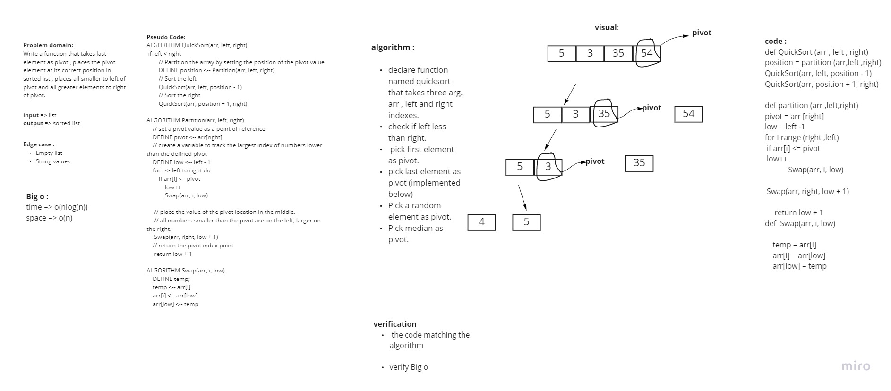

## Quick Sort CC 28
Implement quick sort on a given array.

A conquer and divide style sorting algorythm. It chooses a pivot value and partitions the input array into a left and right array. The main difference between merge sort and quick sort is that by the time quick sort has broken up the array into sub arrays of single elements the array is sorted.

## Whiteboard

