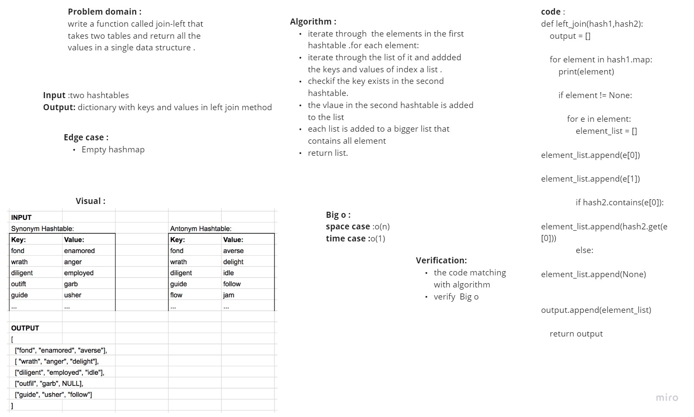

# Challenge
The challenge was with collisions and implementing a linked list to solve them, also with testing internals.

# Whiteboard Process

# Approach & Efficiency
The approach used is to convert the key of the input into index and put the key value object in the hashtable, that contains a linked list for the collisions.
Big O Notation
Time: O(1)
Space: O(N)
