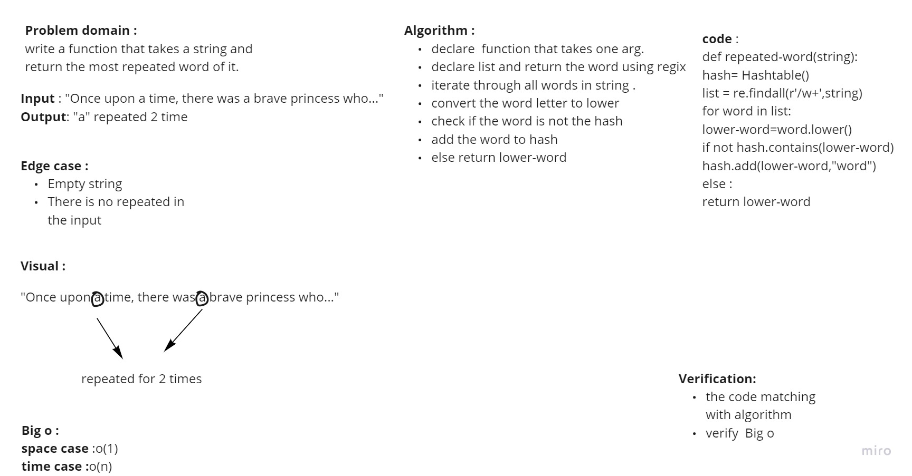

# Challenge Summary
Write a function called repeated word that finds the first word to occur more than once in a string

# Whiteboard Process

# Approach & Efficiency
- declare  function that takes one arg.
- declare list and return the word using regix
- iterate through all words in string .
- convert the word letter to lower
- check if the word is not the hash
