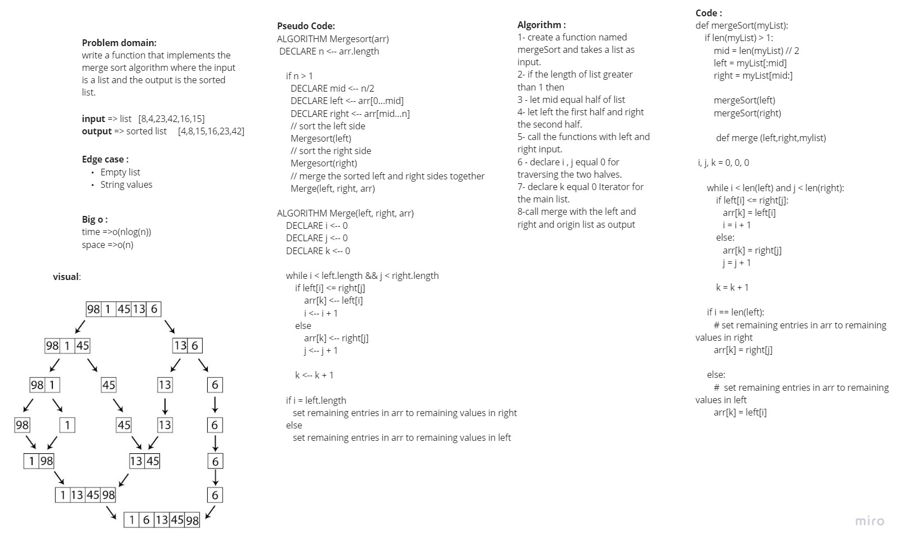

## Challenge Summary
Create function take an array as argument than sort it in Merge Sort.

## Whiteboard Process

## Approach & Efficiency
- Ceate function take array of numbers as arg
- declear n equal the length of array
