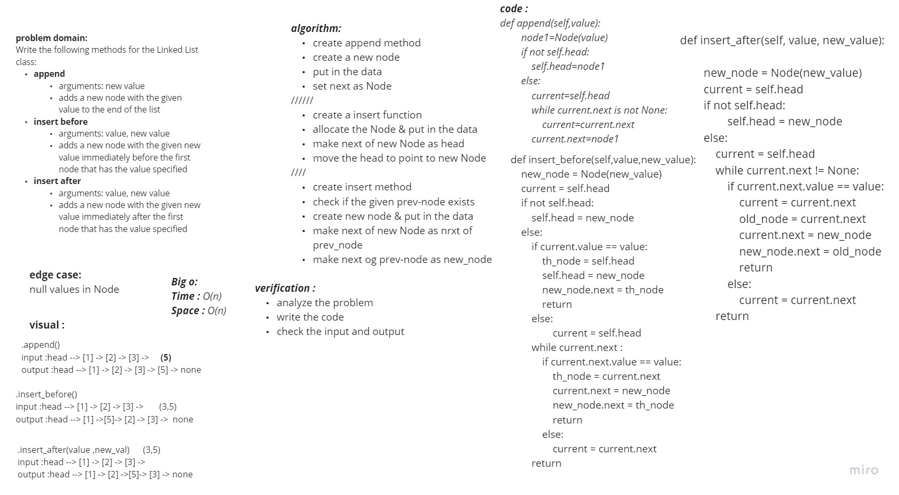
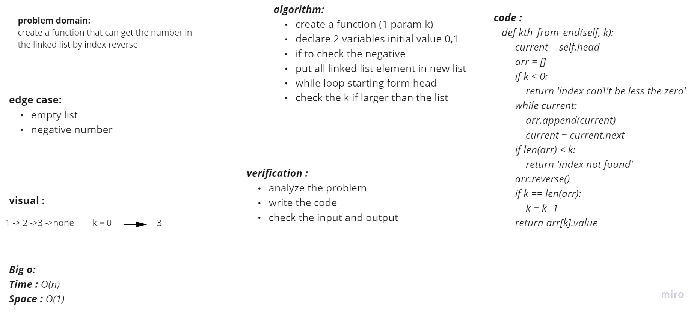

## Singly Linked List
A singly linked list is a type of linked list that is unidirectional, that is, it can be traversed in only one direction from head to the last node (tail).

## Challenge
it was hard to deal with tests

## Approach & Efficiency
O(n) for str function

## API

## whitebord code06

## whitebord code07

